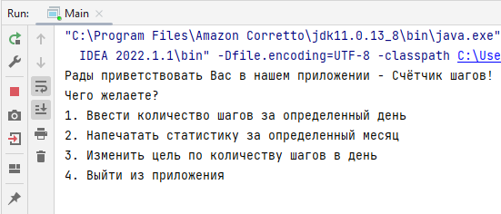

## Step Tracker
#### (англ. "Счётчик шагов")
***

### Прототип приложения для подсчёта шагов

###### Приложение разработано в рамках прохождения учебного курса [Java-разработчик от Яндекс.Практикум](https://practicum.yandex.ru/java-developer/)
***
## Идея
***
Компания по производству спортивных носков решила разработать свой счётчик шагов для дополнительной
мотивации ведения здорового образа жизни
 

## Основа
***
Класс `Main`
 В этом классе реализован основной цикл приложения — считывание команд и вызов
соответствующих методов основного класса приложения — StepTracker. Вся работа с пользовательским
вводом и выводом осуществляется в этом классе.
 Класс `StepTracker`
 Это класс с основной логикой приложения — в нём хранится информация о пройденных шагах, реализована
логика по сохранению и изменению количества шагов, а так же рассчитывается статистика.

## Функционал
***
Пользователь взаимодействует с приложением через консольный интерфейс, который позволяет произвести
одновременно одно из действий по выбору:
- ввести количество шагов за определённый день;
- напечатать статистику за определённый месяц;
- изменить цель по количеству шагов в день;
- выйти из приложения.

После выбора и исполнения действия, программа позволяет пользователю ввести следующее
  действие. Программа завершается только при вводе пользователем команды выхода. При вводе
  несуществующей команды выводится сообщение о том, что такой команды нет, после чего
  приложение позволяет снова выбрать следующее действие.

В памяти приложения хранится следующая информация:
- название месяца и данные о шагах пройденных в каждый день этого месяца. Для удобства подсчета 
  принято, что в любом месяце 30 дней.
 Вывод статистики за указанный пользователем месяц в формате:
  >1 день: 3000, 2 день: 2000, ..., 30 день: 10000
- целевое количество шагов. При старте приложения устанавливается равным 10000.
 Если за какой-то день статистика не сохранялась, то количество шагов в этот день становится 
  равным 0.
- общее количество шагов за месяц;
- максимальное пройденное количество шагов в месяце;
- среднее количество шагов;
- пройденная дистанция (в км);
- количество сожжённых килокалорий;
- _лучшая серия:_ максимальное количество подряд идущих дней, в течение которых количество шагов 
за день было равно или выше целевого.

## Стек технологий
***
- *[Windows](https://www.microsoft.com/ru-ru/software-download/windows10) 10* - операционная
система
- *[Java](https://www.java.com/ru/) 11* - язык программирования
- *[IntelliJ IDEA](https://www.jetbrains.com/ru-ru/idea/download/?ysclid=l8l4s0cdro888284513#section=windows) 2022.1.4 (Ultimate Edition)* - среда разработки

## Запуск приложения
___
На Вашем компьютере должны быть установлены соответствующие приложения из раздела ["Стек
технологий"](#стек-технологий).
 Для запуска приложения необходимо:
- склонировать [проект](https://github.com/gorden73/java-sprint1-hw) на свой компьютер
- открыть склонированный проект в *[IntelliJ IDEA](https://www.jetbrains.com/ru-ru/idea/download/?ysclid=l8l4s0cdro888284513#section=windows)*
- запустить выполнение главного метода программы `Main`, нажав на зелёный треугольник в верхней 
  панели, 
 
 либо слева от названия главного класса
 
 После компиляции и запуска приложения откроется такое окно консоли
 
 Готово, можно пользоваться приложением, выбирая подходящее действие.

## Автор
___
Связаться с автором проекта можно в [telegram](https://web.telegram.org/) (@gorden73).

[Вернуться в начало](#step-tracker)